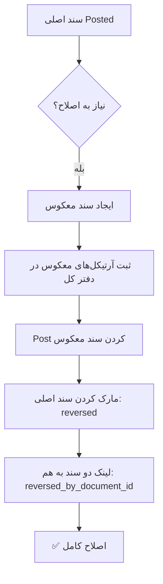

# 🔍 بررسی معماری: اصلاح اسناد و Service-Oriented Architecture

**تاریخ:** 2026-01-24

---

## 📋 سوالات کلیدی

### 1️⃣ آیا اصلاح سند داریم؟ ✅

**پاسخ: بله، کامل پیاده‌سازی شده!**

#### ✅ روش‌های اصلاح سند:

##### 1. **Reverse Document (برگشت سند)**
- **مکان:** `DocumentService::reverseDocument()`
- **خط:** 71-127
- **نحوه کار:**
  ```php
  // ایجاد سند معکوس (Reversal Entry)
  $reversalDocument = $documentService->reverseDocument($documentId, $reason);
  
  // سند جدید با آرتیکل‌های معکوس:
  // Debit ↔ Credit
  ```

##### 2. **Correction Entry (سند اصلاحی)**
- **مکان:** `LedgerService::reverseDocument()`
- **خط:** 115-160
- **نوع سند:** `AccountingDocument::TYPE_CORRECTION`
- **نحوه کار:**
  ```php
  // ایجاد سند اصلاحی
  $correctionDocument = $ledgerService->reverseDocument($documentId, $reason);
  
  // مارک کردن سند اصلی:
  $originalDocument->status = 'reversed';
  $originalDocument->reversed_by_document_id = $newDocumentId;
  ```

##### 3. **Payment Reversal (برگشت پرداخت)**
- **مکان:** `SupplierPaymentService::reversePayment()`
- **خط:** 186-213
- **نحوه کار:**
  ```php
  // برگشت پرداخت به تامین‌کننده
  $paymentService->reversePayment($paymentId, $reason);
  
  // Action ها:
  // 1. بازگشت مبلغ به فاکتور (افزایش balance_due)
  // 2. ایجاد entry معکوس در دفتر کل
  // 3. تغییر وضعیت پرداخت به 'reversed'
  ```

#### ✅ ویژگی‌های سیستم اصلاح سند:

```
✅ Immutable Ledger - دفتر کل تغییر نمی‌کنه، فقط entry جدید اضافه می‌شه
✅ Audit Trail - تمام تغییرات قابل پیگیری
✅ Reversal Document - سند معکوس با لینک به سند اصلی
✅ Status Management - وضعیت سند: draft, posted, reversed
✅ Prevention - سند برگشت خورده نمی‌تونه دوباره برگشت بخوره
✅ Fiscal Year Check - سال مالی بسته نمی‌تونه اصلاح بشه
```

#### 📊 Flow اصلاح سند:



#### 📝 مثال کد:

```php
use RMS\Accounting\Services\DocumentService;

// برگشت سند
$documentService = app(DocumentService::class);
$reversalDocument = $documentService->reverseDocument(
    documentId: 123,
    reason: 'اشتباه در مبلغ فاکتور'
);

// نتیجه:
// ✅ سند اصلی: status = 'reversed'
// ✅ سند جدید: document_type = 'reversal'
// ✅ آرتیکل‌های معکوس در دفتر کل ثبت شده
// ✅ لینک: $original->reversed_by_document_id = $reversal->id
```

---

## 📋 سوالات کلیدی

### 2️⃣ آیا کلیه امکانات تبدیل به سرویس شده؟ ✅

**پاسخ: بله، معماری Service-Oriented کامل است!**

---

## 🏗️ Service-Oriented Architecture (SOA)

### ✅ همه Business Logic در Services قرار دارد

#### 📊 لیست کامل Services (18 سرویس):

| # | Service | مسئولیت | Status |
|---|---------|---------|--------|
| 1 | **LedgerService** | دفتر کل، Double-Entry، Immutable | ✅ |
| 2 | **DocumentService** | مدیریت اسناد، Post، Reverse | ✅ |
| 3 | **AccountService** | Chart of Accounts | ✅ |
| 4 | **CurrencyService** | مدیریت ارز، FX Rates | ✅ |
| 5 | **FiscalYearService** | سال مالی | ✅ |
| 6 | **FiscalYearClosingService** | بستن سال مالی | ✅ |
| 7 | **CustomerInvoiceService** | فاکتور مشتری (AR) | ✅ |
| 8 | **CustomerPaymentService** | دریافت از مشتری | ✅ |
| 9 | **SupplierInvoiceService** | فاکتور خرید (AP) | ✅ |
| 10 | **SupplierPaymentService** | پرداخت به تامین‌کننده | ✅ |
| 11 | **PurchaseOrderService** | سفارش خرید | ✅ |
| 12 | **ExpenseService** | مدیریت هزینه‌ها | ✅ |
| 13 | **COGSService** | بهای تمام شده | ✅ |
| 14 | **TaxService** | مالیات (VAT & Income Tax) | ✅ |
| 15 | **TaxCalculator** | محاسبات مالیاتی | ✅ |
| 16 | **ReconciliationService** | تطبیق | ✅ |
| 17 | **SettlementService** | تسویه | ✅ |
| 18 | **ReportService** | 70+ گزارش مالی | ✅ |

---

## 🌉 Bridge Pattern: API برای اتصال به سایر پکیج‌ها

### ✅ Service API Controllers (5 Controller)

این API ها مخصوص اتصال به پکیج‌های دیگر هستند (Shop, Inventory, HR, ...)

#### 1️⃣ **SalesApiController** (برای Shop)

```php
namespace RMS\Accounting\Http\Controllers\Api\Service;

class SalesApiController
{
    // ثبت فاکتور فروش از shop
    POST /api/service/accounting/sales/record-invoice
    
    // ثبت دریافت از shop
    POST /api/service/accounting/sales/record-payment
}
```

**مثال استفاده:**
```php
// در پکیج Shop:
use Illuminate\Support\Facades\Http;

// ثبت فاکتور
$response = Http::post('http://api/service/accounting/sales/record-invoice', [
    'customer_id' => 123,
    'order_id' => 456,
    'items' => [...],
    'total_amount' => 1000000,
]);
```

---

#### 2️⃣ **CustomersApiController** (برای Shop/CRM)

```php
// دریافت مانده مشتری
GET /api/service/accounting/customers/{id}/balance

// Response:
{
    "customer_id": 123,
    "balance": 5000000,
    "currency": "IRR",
    "invoices_count": 10,
    "unpaid_invoices": 3
}
```

---

#### 3️⃣ **PurchasesApiController** (برای Inventory)

```php
// ثبت فاکتور خرید از inventory
POST /api/service/accounting/purchases/record-invoice

// ثبت پرداخت به تامین‌کننده
POST /api/service/accounting/purchases/record-payment
```

---

#### 4️⃣ **InventoryApiController** (برای Inventory)

```php
// ثبت بهای تمام شده (COGS)
POST /api/service/accounting/inventory/record-cogs

// Request:
{
    "product_id": 789,
    "quantity": 10,
    "cost_per_unit": 50000,
    "total_cost": 500000
}
```

---

#### 5️⃣ **CurrenciesApiController** (برای همه)

```php
// دریافت نرخ ارز فعلی
GET /api/service/accounting/currencies/{code}/rate

// Response:
{
    "currency": "USD",
    "rate_to_irr": 42000,
    "updated_at": "2026-01-24 10:30:00"
}
```

---

### 🔐 Authentication برای Service API

```php
// config/service_api.php
return [
    'enabled' => true,
    'api_key' => env('SERVICE_API_KEY', 'default-key'),
    'trusted_services' => [
        'shop',
        'inventory',
        'hr',
        'crm',
    ],
];

// Middleware:
Route::middleware(['api', 'service-api-auth'])
```

---

## 🔗 Route Structure

### 1️⃣ Admin API Routes (برای پنل ادمین)

```
/api/accounting/admin/*
```

| Controller | مسئولیت | تعداد Endpoints |
|-----------|---------|-----------------|
| AccountsApiController | مدیریت حساب‌ها | 5 |
| LedgerApiController | دفتر کل | 3 |
| DocumentsApiController | اسناد | 5 |
| CustomerInvoicesApiController | فاکتور مشتری | 5 |
| CustomerPaymentsApiController | دریافت | 5 |
| ExpensesApiController | هزینه‌ها | 5 |
| ReportsApiController | گزارش‌ها | 10+ |

**مجموع: 7 Controller، 40+ Endpoint**

---

### 2️⃣ Service API Routes (برای پکیج‌های دیگر)

```
/api/service/accounting/*
```

| Endpoint | نحوه استفاده |
|----------|--------------|
| `POST /sales/record-invoice` | Shop → Accounting |
| `POST /sales/record-payment` | Shop → Accounting |
| `GET /customers/{id}/balance` | Shop/CRM → Accounting |
| `POST /purchases/record-invoice` | Inventory → Accounting |
| `POST /purchases/record-payment` | Inventory → Accounting |
| `POST /inventory/record-cogs` | Inventory → Accounting |
| `GET /currencies/{code}/rate` | Any → Accounting |

**مجموع: 5 Controller، 10+ Endpoint**

---

### 3️⃣ Tax API Routes (عمومی)

```
/api/accounting/tax/*
```

| Endpoint | نحوه استفاده |
|----------|--------------|
| `GET /tax/settings` | دریافت تنظیمات مالیاتی |
| `POST /tax/calculate-vat` | محاسبه VAT |
| `POST /tax/calculate-income-tax` | محاسبه مالیات درآمد |
| `GET /tax/vat-rates` | دریافت نرخ‌های VAT |
| `GET /tax/vat-payable` | محاسبه مالیات قابل پرداخت |
| `POST /tax/calculate-multiple` | محاسبه مالیات چند آیتم |

**مجموع: 1 Controller، 6 Endpoint**

---

## 🎯 Bridge Implementation برای Shop

### مثال: اتصال Shop به Accounting

```php
// در پکیج Shop: app/Services/OrderService.php

namespace App\Shop\Services;

use Illuminate\Support\Facades\Http;

class OrderService
{
    /**
     * ثبت سفارش در حسابداری
     */
    public function recordOrderInAccounting(Order $order)
    {
        $response = Http::withToken(config('services.accounting.api_key'))
            ->post(config('services.accounting.base_url') . '/api/service/accounting/sales/record-invoice', [
                'customer_id' => $order->customer_id,
                'order_id' => $order->id,
                'invoice_date' => $order->created_at,
                'due_date' => $order->created_at->addDays(30),
                'items' => $order->items->map(fn($item) => [
                    'product_id' => $item->product_id,
                    'product_name' => $item->product_name,
                    'quantity' => $item->quantity,
                    'price' => $item->price,
                ]),
                'subtotal' => $order->subtotal,
                'total_amount' => $order->total,
                'currency_code' => 'IRR',
            ]);
        
        if ($response->successful()) {
            $order->update([
                'accounting_invoice_id' => $response->json('invoice_id'),
            ]);
        }
    }
    
    /**
     * ثبت پرداخت در حسابداری
     */
    public function recordPaymentInAccounting(Payment $payment)
    {
        Http::withToken(config('services.accounting.api_key'))
            ->post(config('services.accounting.base_url') . '/api/service/accounting/sales/record-payment', [
                'invoice_id' => $payment->order->accounting_invoice_id,
                'amount' => $payment->amount,
                'payment_date' => $payment->paid_at,
                'payment_method' => $payment->method,
                'reference_number' => $payment->transaction_id,
            ]);
    }
}
```

---

## 📦 مثال: اتصال Inventory به Accounting

```php
// در پکیج Inventory: app/Services/StockService.php

namespace App\Inventory\Services;

use Illuminate\Support\Facades\Http;

class StockService
{
    /**
     * ثبت COGS هنگام فروش
     */
    public function recordCOGS(Product $product, int $quantity)
    {
        $cost = $product->calculateAverageCost() * $quantity;
        
        Http::withToken(config('services.accounting.api_key'))
            ->post(config('services.accounting.base_url') . '/api/service/accounting/inventory/record-cogs', [
                'product_id' => $product->id,
                'product_sku' => $product->sku,
                'product_name' => $product->name,
                'quantity' => $quantity,
                'cost_per_unit' => $product->calculateAverageCost(),
                'total_cost' => $cost,
                'currency_code' => 'IRR',
            ]);
    }
    
    /**
     * ثبت فاکتور خرید
     */
    public function recordPurchaseInvoice(PurchaseOrder $po)
    {
        Http::withToken(config('services.accounting.api_key'))
            ->post(config('services.accounting.base_url') . '/api/service/accounting/purchases/record-invoice', [
                'supplier_id' => $po->supplier_id,
                'purchase_order_id' => $po->id,
                'invoice_date' => now(),
                'items' => $po->items->map(fn($item) => [
                    'product_id' => $item->product_id,
                    'quantity' => $item->quantity,
                    'price' => $item->price,
                ]),
                'total_amount' => $po->total,
            ]);
    }
}
```

---

## ✅ Checklist معماری Service-Oriented

### Core Services:
- [x] همه Business Logic در Services
- [x] Controllers فقط HTTP Handling
- [x] Services قابل تست مستقل
- [x] Dependency Injection
- [x] Single Responsibility

### Bridge/Integration:
- [x] Service API برای پکیج‌های دیگر
- [x] Authentication & Authorization
- [x] RESTful Design
- [x] JSON Response Standard
- [x] Error Handling

### Document Correction:
- [x] Reverse Document
- [x] Correction Entry
- [x] Payment Reversal
- [x] Immutable Ledger
- [x] Audit Trail
- [x] Status Management

---

## 🎯 نتیجه‌گیری

### ✅ پاسخ سوال 1: اصلاح سند

**بله، سیستم اصلاح سند کامل است:**
- ✅ Reverse Document (سند معکوس)
- ✅ Correction Entry (سند اصلاحی)
- ✅ Payment Reversal (برگشت پرداخت)
- ✅ Immutable Ledger (دفتر کل تغییر نمی‌کنه)
- ✅ Audit Trail (قابل پیگیری)

---

### ✅ پاسخ سوال 2: Service-Oriented

**بله، معماری SOA کامل است:**
- ✅ 18 Service کامل
- ✅ 5 Service API Controller برای Bridge
- ✅ 50+ API Endpoint
- ✅ Authentication & Authorization
- ✅ آماده برای اتصال به Shop, Inventory, HR, CRM

---

## 🚀 آماده برای Production!

**هسته حسابداری:**
- ✅ مستقل و قابل نصب
- ✅ Service-Oriented Architecture
- ✅ Bridge Pattern برای Integration
- ✅ اصلاح سند با Audit Trail
- ✅ RESTful API
- ✅ Documentation کامل

**تاریخ:** 2026-01-24  
**وضعیت:** ✅ Production Ready
